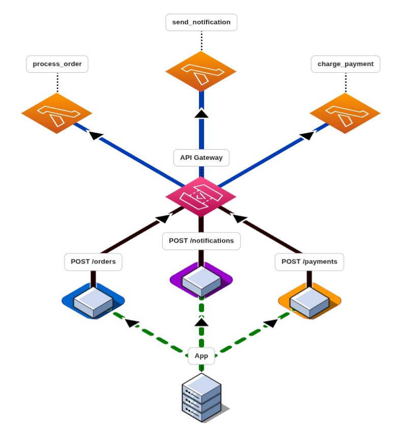

# IFPE - Sistemas Distribuídos
## Protótipo de Arquitetura Serverless
### Discente: Heitor Fidelis
### Professor: Luciano de Souza Cabral

<hr>

**Tecnologias Utilizadas:**
- LocalStack (Serviços AWS mockados localmente)
- Terraform (Iac)
- Python 3.10
- AWS Lambda
- AWS API Gateway

**Como executar o protótipo:**
1. Clonar o repositório:
    ```bash
    git clone https://github.com/hfidelis/distributed-systems-ifpe
    cd distributed-systems-ifpe/serverless-architecture
    ```
2. Executar o LocalStack via docker-compose:
    ```bash
    docker-compose up -d
    ```
3. Aplicar a infraestrutura com Terraform:
    ```bash
    terraform init
    terraform apply -auto-approve
    ```
    **Ao final da aplicação, será exibido o ID {api_id} da API no API Gateway.**
4. Testar as funções Lambda via endpoint do API Gateway:
**Endpoints:**

**POST** http://localhost:4566/restapis/{api_id}/dev/_user_request_/orders
**POST** http://localhost:4566/restapis/{api_id}/dev/_user_request_/notifications
**POST** http://localhost:4566/restapis/{api_id}/dev/_user_request_/payments

Payloads:
- **POST** /orders:
```json
{
  "order_id": "string",
  "customer": "string",
  "items":[
    {
        "name":"string",
        "price": "float",
        "quantity": "int",
    },
  ]
}
```

- **POST** /notifications:
```json
{
  "order_id": "string",
  "customer": "string",
  "type": "string"
}
```

- **POST** /payments:
```json
{
  "order_id": "string",
  "amount": "float",
  "card_number": "string"
}
```


### Arquitetura do protótipo:**




